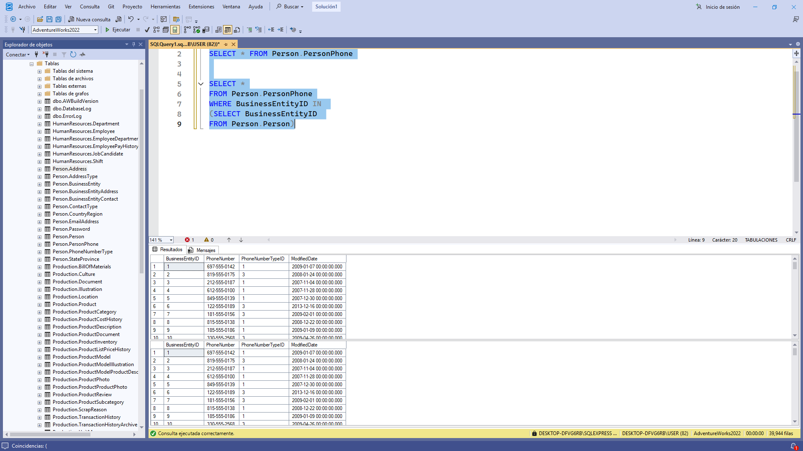

# 📸 Álbum de Fotos
----------------------------------------------------------------------------
Bienvenido a mi álbum personal. Aquí voy guardando una foto por día.

## 📂 Contenido del Álbum
- 📑 **Consultas SQL** → Scripts usados en el proyecto.  
- 🖼️ **Evidencias visuales** → Capturas de resultados (screenshots).  
- 🗂️ **Base de datos** → Archivos `.sql` y documentación relacionada.
- 
  
----------------------------------------------------------------------------

1... 

2...

3...

4...

5...

6...

7...

8...

